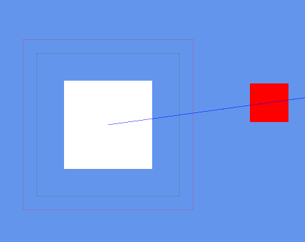

# AI for Digital Games

<!--
Course Plan: https://utbildningsinfo.mau.se/kurs/kursplan/da408a/20242
Course Guide: https://mau.instructure.com/courses/16904/files/2865718/download?download_frd=1
Course introduction slides: https://mau.instructure.com/courses/16904/files/2864465/download?download_frd=1 
-->

This game consists of autonomous squares (also referred to as **agents** in both code and documentation) who must flee from bigger squares to avoid being eaten while finding smaller squares to eat in order to grow bigger.

On a technical level, the squares possess three distinct behaviours:

- Fleeing from another square

- Chasing another square until contact (and consumption)

- Roaming/Patrolling (neither chasing nor fleeing)

A primary **objective** for each square is to **survive**. A secondary and arguably more important objective is to **grow as large as possible** by eating smaller squares.

## Assignment 1

`This section is under construction...`

## Assignment 2

`This section is under construction...`

## Neural Network

[SKIP TO RESULT](#result)

### How it works

1. Initialize the neural network (and its weights)
2. Update the [input nodes](#input-nodes-what-our-neural-networks-will-know)' values based on current in-game variables
3. Let the neural network compute and return its highest value [output node](#output-nodes-how-our-neural-network-can-choose-to-behave)
4. Have `NeuralNetworkBrain` read and trigger a behaviour associated with the [output node](#output-nodes-how-our-neural-network-can-choose-to-behave)

**KEY THINGS TO NOTE:**

- Our neural network initializes weights **randomly**
- We do not train our neural network in any capacity

### Input Nodes: What our neural networks will know

In our rudimentary implementation of a neural network (`BabyNeuralNetwork` in `NeuralNetwork.cs`), we have **three** input nodes:

1. Distance to the nearest agent
2. X-direction to nearest agent
3. Y-direction to nearest agent

The idea is that with these pieces of information, a neural network could in theory react to how fast and how large its closest counterpart is. Reacting to the latter is possible because **an agent's size is dependent on its speed**.

### Output Nodes: How our neural network can choose to behave

In our basic neural network class (`BabyNeuralNetwork`), we have three pre-defined behaviours and output nodes:

1. Fleeing
2. Chasing
3. Patrolling; Neither fleeing or chasing

Because these outcomes are very simple and understanding when to do what is trivial, a neural network is really overkill and will likely perform worse than our other brains. What might make the neural network more impactful is if we add more precise decision making for how fast or slow to chase/flee/patrol and how hard to steer (and in which direction?).

An alternative that should seem relatively simple would be to have the neural network simply decide which direction it should go.

### Result

Due to our **lack of training and randomised weights**, the neural network is prone to either overly aggressive, overly passive, and overly cautious decision-making. It is outperformed by all other methods tested in this assignment.

> [!NOTE] 
> The neural network actually scores better agent *lifespans* when it happens to favour overly cautious behaviour.
